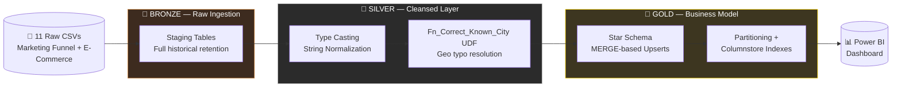
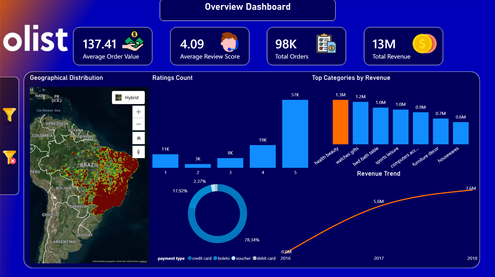

<div align="center">


<br/>

### *Turning 11 Fragmented CSVs into a Single, Blazing-Fast Source of Truth*


<br/><br/>

[](#)
[](#)
[](#)
[](#)

   

**Author:** Abdallah Ali Abdelgawad

</div>

<br/>

## 🧭 Table of Contents

<div align="center">

[🎯 Executive Summary](#-executive-summary) • [🏗️ Architecture](#️-architecture-the-medallion-pipeline) • [🗄️ Data Modeling](#️-data-modeling-star-schema-design) • [🚀 Performance](#-performance--scalability-engineering) • [📊 Insights](#-analytical-reporting--business-insights) • [📁 Source Data](#-source-systems--data-origin) • [🧠 Why It Matters](#-why-this-project-matters)

</div>

<br/>

---

## 🎯 Executive Summary

Olist's operational systems held rich data — but it was scattered across **11 highly normalized flat files**, buried under 6+ table joins, and unusable for fast, reliable business reporting.

This project re-engineers that raw operational mess into an **enterprise-grade analytical Data Warehouse**, hand-built in **T-SQL** and modeled as a performance-tuned **Star Schema**.

<table>
<tr>
<td width="50%" valign="top">

### 🔴 Before
- 11 disconnected raw CSVs
- 6+ table joins per query
- No historical tracking
- Slow, unindexed aggregations
- No single source of truth

</td>
<td width="50%" valign="top">

### 🟢 After
- Unified, governed Star Schema
- Single-hop fact ↔ dimension joins
- Full SCD Type 2 history
- Partitioned + columnstore-indexed
- Live Power BI dashboard

</td>
</tr>
</table>

> **The core engineering challenge solved here:** turning a transactional, join-heavy OLTP system into a partitioned, indexed, historically-accurate OLAP warehouse — without losing a single early-arriving fact or historical customer relocation along the way.

<br/>

---

## 🏗️ Architecture: The Medallion Pipeline

The pipeline follows the **Medallion Architecture** — Bronze → Silver → Gold — chosen specifically to guarantee data quality, full auditability, and safe reprocessing at every stage.



| Layer | Purpose | Key Techniques |
|---|---|---|
| 🥉 **Bronze (Raw)** | Bulk ingestion of 11 raw CSV files spanning Olist's Marketing Funnel and E-Commerce datasets | Staging tables, full historical raw retention |
| 🥈 **Silver (Cleansed)** | Data cleansing, type casting, and normalization | Custom `Fn_Correct_Known_City` UDF to resolve complex geographic typos |
| 🥇 **Gold (Business Model)** | Analytics-ready Star Schema | `MERGE`-based upserts, surrogate keys, SCD Type 2 |

<br/>

---

## 🗄️ Data Modeling: Star Schema Design

The Gold Layer eliminates the 6+ table joins required by the source OLTP system, collapsing them into a single, BI-optimized **Star Schema** that dramatically boosts query performance.

<div align="center">

</div>

<br/>

<table>
<tr>
<td width="50%" valign="top">

### 📊 Fact Tables
| Table | Grain |
|---|---|
| `Fact_Orders` | 1 row / order |
| `Fact_Order_Items` | 1 row / line item |
| `Fact_Payments` | 1 row / payment |
| `Fact_Reviews` | 1 row / review |
| `Fact_Marketing_Funnel` | 1 row / lead event |

</td>
<td width="50%" valign="top">

### 🧩 Dimension Tables
| Table |
|---|
| `Dim_Customer` |
| `Dim_Seller` |
| `Dim_Product` |
| `Dim_Date` |

</td>
</tr>
</table>

### ⚙️ Advanced Modeling Techniques

<details open>
<summary><b>🔑 Surrogate Keys & Unknown Members</b></summary>
<br/>

Every dimension uses `IDENTITY` surrogate keys, with default `-1` "unknown member" rows injected to gracefully absorb early-arriving facts without ever breaking referential integrity.
</details>

<details open>
<summary><b>🕒 Slowly Changing Dimensions (SCD Type 2)</b></summary>
<br/>

Applied to `Dim_Customer` and `Dim_Seller` to track geographical relocations over time, so historical orders always report against the freight and routing logic that was accurate *at the time of purchase* — not today's address.
</details>

<br/>

---

## 🚀 Performance & Scalability Engineering

This warehouse isn't just modeled well — it's physically tuned to stay fast as data grows:

<table>
<tr>
<td width="50%" valign="top">

### 📐 Table Partitioning
Fact tables (`Fact_Orders`, `Fact_Order_Items`) are physically partitioned by `Purchase_Date_Key` into yearly ranges (2017, 2018, 2019+), enabling **partition elimination** so time-series queries only scan the data they actually need.

</td>
<td width="50%" valign="top">

### ⚡ Columnstore Indexing
Nonclustered Columnstore Indexes (NCCI) applied to fact tables dramatically cut I/O for the heavy `SUM` and `AVG` aggregations that power the BI layer.

</td>
</tr>
</table>

<br/>

---

## 📊 Analytical Reporting & Business Insights

The warehouse culminates in a comprehensive **Power BI** dashboard built directly on the Gold Star Schema, engineered to answer Olist's core business questions at a glance.

<div align="center">

</div>

<br/>

<div align="center">

| 📦 Orders | 💰 Revenue | 🧾 AOV | 📈 2017 → 2018 |
|:---:|:---:|:---:|:---:|
| **98K** | **$13M** | **$137.41** | **$5.6M → $7.6M** |

</div>

### 🏆 Top Categories by Revenue
```
Health & Beauty   ████████████████████░░  $1.3M
Watches & Gifts   ██████████████████░░░░  $1.2M
```

### 💳 Payment Method Split
```
Credit Card   ███████████████████████████░  78.34%
Boleto        ██████░░░░░░░░░░░░░░░░░░░░░░  17.92%
```

<br/>

---

## 📁 Source Systems & Data Origin

The warehouse is built on **11 highly normalized flat files** sourced from Kaggle, representing two of Olist's core operational systems:

<div align="center">

| System | Represents |
|:---:|:---:|
| 🧲 **CRM** | Marketing Funnel dataset |
| 🏭 **ERP** | Orders, Payments, Products, Reviews datasets |

</div>

<div align="center">

</div>

<br/>

---

## 🧠 Why This Project Matters

Most student and portfolio data projects stop at "load a CSV into a table." This one goes further — it mirrors how real enterprise data teams operate:

- ✅ A governed, auditable multi-layer pipeline (Bronze/Silver/Gold)
- ✅ Production-grade dimensional modeling (surrogate keys, SCD Type 2, unknown members)
- ✅ Physical performance tuning (partitioning + columnstore indexing) — not just logical design
- ✅ A BI layer that translates the model directly into business answers

<br/>

<div align="center">

---

### Built with T-SQL, Star Schema modeling, and a relentless focus on query performance.


</div>

<br/>


